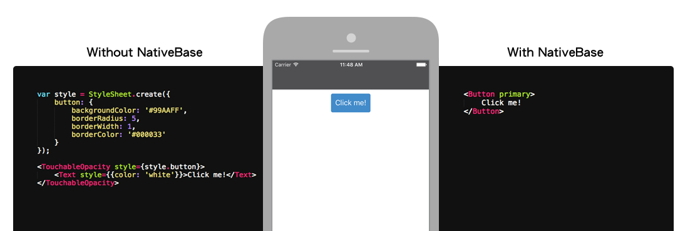
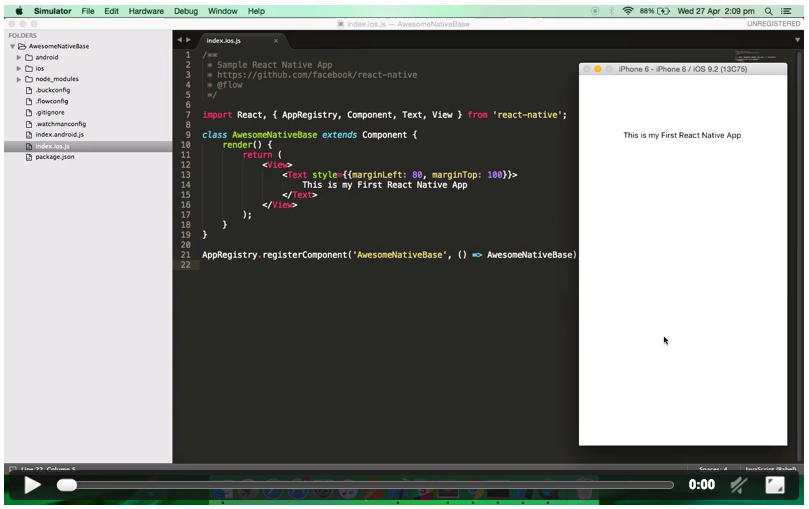

# NativeBase v0.5.8
The missing piece of React Native


Get on the mobile fast track with NativeBase, the fastest-growing platform and tool set for iOS and Android development. Get an introduction to NativeBase and work through an instance application that highlights React Native programming techniques.


# Contents

-	[What is NativeBase?](#what-is-nativebase)
-	[Testimonials](#testimonials)
-	[Why NativeBase?](#why-nativebase)
-	[Magic of NativeBase](#magic-of-nativebase)
-	[Change Log](https://github.com/GeekyAnts/NativeBase/releases/tag/v0.5.8)
-	[Get Started](#get-started)
-	[Components](#components)
-	[Native Starter Kit](#native-starter-kit)
-	[Featured Apps](#featured-apps)
	-	[Native Starter Pro](#native-starter-pro---v500)
	-	[Ecommerce Starter](#ecommerce-starter---v500)
	-	[Flat App Theme](#flat-app-theme---v400)
-	[Quick Links to NativeBase](#quick-links-to-nativebase)
-	[Documentation](#documentation)
-	[Website](#website)


## What is NativeBase
[NativeBase](http://nativebase.io/) is a free and open source framework that enables developers to build high-quality mobile apps using [React Native](https://github.com/facebook/react-native) iOS and Android apps with a fusion of [ES6](http://es6-features.org/#Constants). NativeBase builds a layer on top of React Native that provides you with basic set of components for mobile application development. This helps you to build world-class application experiences on native platforms.


The applications stack of components is built using native UI components and because of that, there are no compromises with the User Experience of the applications. NativeBase is targeted specially on the look and feel, and UI interplay of your app. NativeBase without a doubt fits in well with mobile applications which cuts down one huge part of your app - The Front end.

What is really great is that you can use shared UI cross-platform components, which will drastically increase your productivity. When using NativeBase, you can use any native third-party libraries out of the box. You do not need to use wrappers or do any other actions. The new additions to the native platform are available immediately. NativeBase provides amazing support for adding components, so that you will by no means hit a lifeless stop. [Read More. . .](http://nativebase.io/documentation)

One import statement, and you get all NativeBase components.
```
import { list of Components } from 'native-base';
```


## Testimonials

Some quotes from users of **NativeBase**

**Recommended by** 
> If you're looking to get started with React Native + CodePush, and are looking for an awesome starter kit, you should check out Native Starter Pro - [Microsoft's react-native-code-push repo](https://github.com/Microsoft/react-native-code-push#example-apps--starters)

**Recommended by [Awesome React Native](https://github.com/jondot/awesome-react-native)**
>NativeBase added into the list of [Frameworks](https://github.com/jondot/awesome-react-native#frameworks) of Awesome React Native.

**Peer Richelsen**
>I highly recommend NativeBaseIO for React Native mobile app development. It speeds up development by 1000%

**moosawi**
>Best framework for React Native.

**redbaron76**
>This is a great project, well documented and a big help for developers.

**vitalets**
>Thanks for such useful library.

**robtweed**
>The components look great, and I'd love to use them.

**chromakey**
>Thanks for a great library. I appreciate the quick fix!

**webinspired**
>Ran thru the demo.... it was amazing...

**mrphu3074**
>NativeBase is rapid my prototype, I really love it.

**michshat**
>This framework looks really good - Thank you!

**Nickman87**
>I'm trying out your nativeBase package as it looks like it can simplify a lot of my views.

**RezaRahmati**
>Great library.


## Why NativeBase?
<center></center>

Do you still have a question **Why NativeBase**?

If yes then go ahead and watch this magic.


## Magic of NativeBase
<center>[](http://nativebase.io/docs/v0.2.1/assets/img/magic-with-nativebase-020.mp4)</center>

<i>Click to watch the magic</i>


## Get Started

**System Requirements**

* Globally installed [node](https://nodejs.org/en/) >= 4.0

* Globally installed [npm](https://www.npmjs.org/) >= 3.0


**Installation**

To have NativeBase components running onto your native apps, all you need to do is create a fresh [React Native](https://github.com/facebook/react-native) project and install the [NativeBase](http://nativebase.io/) command line tools.

```
react-native init AwesomeNativeBase

cd AwesomeNativeBase

npm install
```

Include NativeBase into your React Native project.
```
npm install native-base --save
```

Now you are ready to get going with NativeBase. [Read More. . .](http://nativebase.io/documentation)


## Components

[NativeBase](http://nativebase.io/) is made from effective building blocks referred to as components. The Components are constructed in pure [React Native](https://github.com/facebook/react-native) platform along with some JavaScript functionality with rich set of customisable properties. These components allow you to quickly build the perfect interface. 

The most awaited feature, **platform precise components** with single codebase is now available with version 0.5.0 of NativeBase. Along with this, there comes in addition of set of **Fonts** to be readily integrated with your apps. [Read More. . .](http://nativebase.io/documentation)

#### [**Live Demo**](http://nativebase.io/docs/v0.5.5/components)


## [Native Starter Kit](https://github.com/start-react/native-starter-kit)

A simple starter project for [React Native](https://github.com/facebook/react-native) + [NativeBase](http://nativebase.io/) + [Redux](http://redux.js.org/) + [CodePush](https://github.com/Microsoft/react-native-code-push) + [React Native Navigator](https://facebook.github.io/react-native/docs/navigator.html) apps on iOS and Android.

No need of reinventing the wheel. To have immediately something to continue building on, it would be best to start from some starter kit for getting React Native - based applications off the ground in a hurry.

This is a starter kit that you can install on the fly to get the basic plumping of React Native with NativeBase, Redux and CodePush.

[Take a look at the demo](https://github.com/start-react/native-starter-kit#screens)


## Featured Apps

Having tried with the free version, [Native Starter Kit](https://github.com/start-react/native-starter-kit) and appreciate our product?

Get on the mobile fast track with the featured apps of NativeBase, to build high-quality iOS and Android mobile apps. 

Based on [React Native](https://facebook.github.io/react-native/) and [NativeBase](http://nativebase.io/docs/v0.5.5/), Native Starter Pro, Ecommerce Starter, Flat App Theme are beautifully designed with fusion of [Redux](https://github.com/reactjs/react-redux) and [ES6](http://es6-features.org/#Constants), responsive iOS and Android app source code to quickly get started on your next project. 


### Native Starter Pro - v5.0.0

Native Starter Pro is best suited for developing apps that makes use of ready-made tools. The theme has several widget areas that allows you to extend your theme functionality with plugins. 

Native Starter Pro includes following ready-to-use and highly customizable components :

-	UI Elements: Button with various shapes and themes, Textbox, Form Elements, List, Full fledged collection of Icons
-	Custom Elements: Header, Footer, Drawer, Spinner, ProgressBar, Modal, Ready to use Email Template, Interactive design of Calendar with fast swiping feature, Scroll between the tabs, Responsive Navigator, Chat Messenger
-	Ready to use screens
-	Easy theme customization
-	[Read More](http://strapmobile.com/docs/native-starter-pro/v5.0.0)

**Quick links to Native Starter Pro**

-	*[Native Starter Pro Features](http://strapmobile.com/docs/native-starter-pro/v5.0.0/overview/whats-new-in-v5-0-0)*
-	*[Native Starter Pro Components](http://strapmobile.com/docs/native-starter-pro/v5.0.0/components)*
-	*[Native Starter Pro's App Generator](http://strapmobile.com/customizer/#/color)*
-	*[Native Starter Pro Releases](http://strapmobile.com/native-starter-pro-releases/)*


### Ecommerce Starter - v5.0.0

Ecommerce Starter, a perfect starter kit for e-commerce apps. Readily available pages along with rich collection of UI elements.

Ready to use screens:

-	Login
-	Tabs
-	Fluid grid layout to advertise various brands for your products
-	List-view and grid-view of product advertisements
-	Product details in your cart
-	[Read More](http://strapmobile.com/docs/react-native-ecommerce-starter/v5.0.0)

**Quick links to Ecommerce Starter**

-	*[Ecommerce Starter Features](http://strapmobile.com/docs/react-native-ecommerce-starter/v5.0.0/overview/whats-new-in-v5-0-0)*
-	*[Ecommerce Starter Components](http://strapmobile.com/docs/react-native-ecommerce-starter/v5.0.0/components)*
-	*[Ecommerce Starter Releases](http://strapmobile.com/docs/react-native-ecommerce-starter/v5.0.0/release-notes)*


### Flat App Theme - v4.0.0

Flat App is basically a style of interface design emphasizing minimum use of stylistic elements, typography and flat colors.

Ready to use screens:

-	UI Elements: Button with various shapes and themes, Textbox, Form Elements, List, Full fledged collection of Icons
-	Custom Elements: Header, Footer, Drawer, Spinner, ProgressBar, Modal, Ready to use Email Template, Interactive design of Calendar with fast swiping feature, Scroll between the tabs, Responsive Navigator, Chat Messenger
-	Ready to use screens: Channels, Stories, Comments, Carousel, etc
-	Easy theme customization
-	[Read More](http://strapmobile.com/docs/react-native-flat-app-theme/v4.0.0)

**Quick links to Flat App Theme**

-	*[Flat App Theme Features](http://strapmobile.com/docs/react-native-flat-app-theme/v4.0.0/overview/whats-new-in-v4-0)*
-	*[Flat App Theme Components](http://strapmobile.com/docs/react-native-flat-app-theme/v4.0.0/components)*
-	*[Flat App Theme Releases](http://strapmobile.com/docs/react-native-flat-app-theme/v4.0.0/release-notes)*


## Quick Links to NativeBase

*	[NativeBase on Twitter](https://twitter.com/NativeBaseIO)
*	[NativeBase Blog](https://medium.com/nativebase-io-blog)
*	[NativeBase Documentation](http://nativebase.io/documentation)


## Documentation

Go through [NativeBase Docs](http://nativebase.io/documentation) to play with NativeBase.


## Website
[http://nativebase.io/](http://nativebase.io/)
